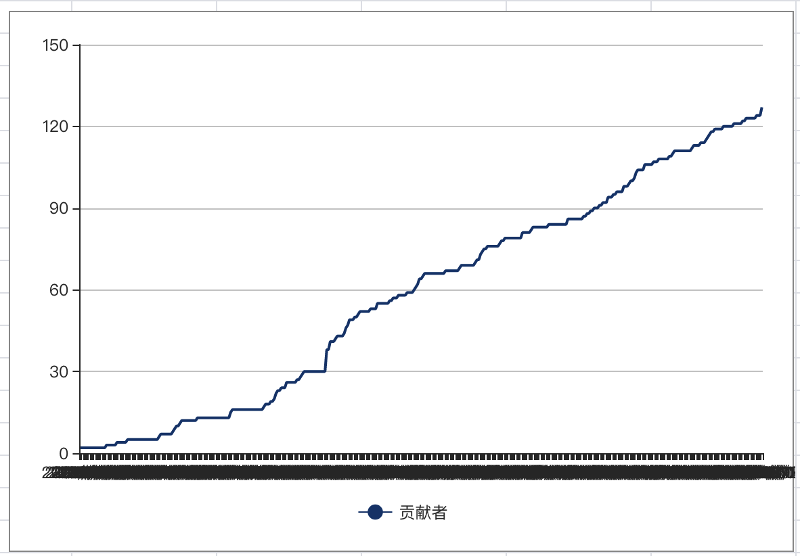
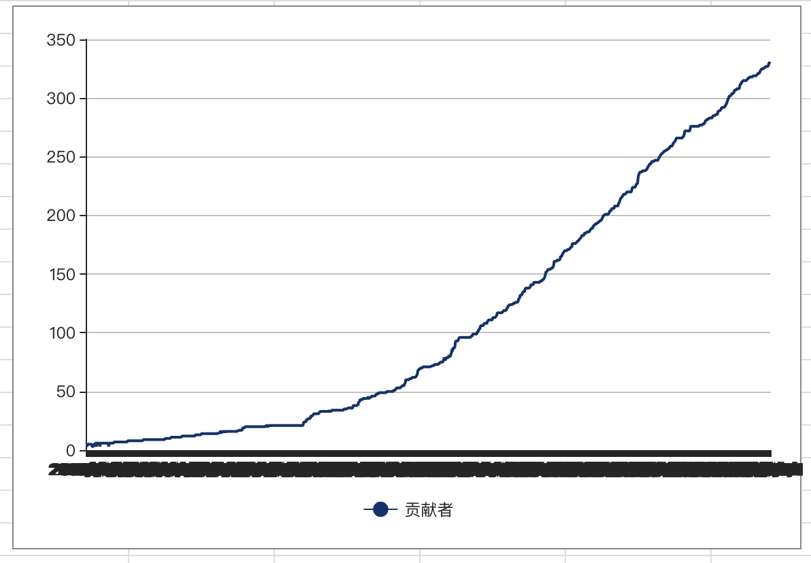

# draw-contributor

draw-contributor 是一款使用 shell 实现的获取 git 项目贡献者历史数据的一款工具，当前

## 如何使用

拷贝脚本到待绘制的 git 项目

```
cp draw-contributor.sh {your proj dir}
```

运行

```
bash draw-contributor.sh
```

获取结果，使用 excel 绘图，结果在当前目录`contributor.txt`文件中。

### 绘制案例

使用该工具绘制 Apache APISIX 的贡献者趋势图如下



使用该工具绘制 Apache Skywalking 的贡献者趋势图如下



## 有什么价值

笔者是一名 Apache 贡献者，认同社区优于代码、社区优于 star 的理念，认为贡献者数量是衡量一个开源社区和开源项目发展是否健康最重要的指标之一。

另一方面，github 虽然支持了绘制 star 历史数据，但并不支持绘制贡献者历史数据

## 贡献者计算方式

当前使用的是`git log`中 commit 用户名信息进行聚合

> 因为一个人往往使用多个邮箱提交，但大家往往不会修改自己的用户名，相较于官方 github 贡献者统计，本工具的误差在 10%以内

## 下一步目标

- 支持 echart 绘图
- 优化脚本，运行得更快
- 更精准的贡献者统计数据

## 现有问题

1. 这种做法对于不是通过 squash 方式合入 PR 的项目，会算的有问题，还需要去识别哪些是 PR commit